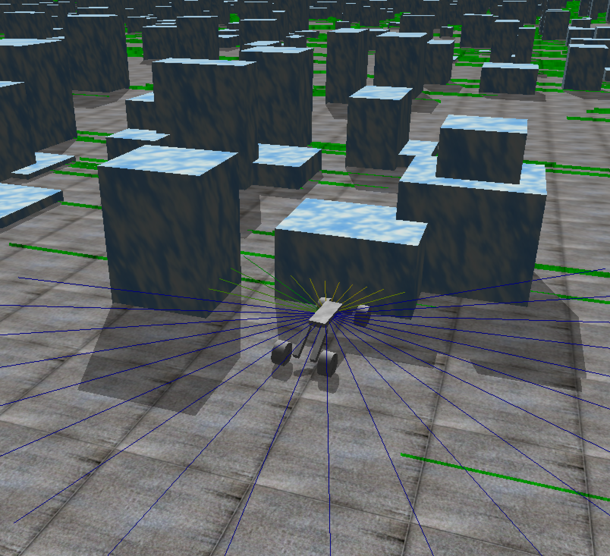

# MultiSim

**MultiSim** is a simulation framework that integrates a physics-based engine with an actor–critic reinforcement learning algorithm to enable wheeled quadrupeds to learn navigation in dynamic obstacle courses. The project is implemented in C++ using the Open Dynamics Engine (ODE) for physics simulation and visualization, while the neural network is built from scratch with an actor–critic architecture.



---

## Overview

MultiSim’s primary goal is to train wheeled quadrupeds to navigate complex, ever-changing environments. The system comprises two core components:

- **Physics-Based Simulation:**  
  Uses ODE to simulate realistic rigid-body dynamics, collision detection, ray casting, and environmental interactions. The simulation creates a dynamic obstacle course with boundary walls, a target object, and thousands of randomly placed obstacles. Each quadruped is modeled as a composite of a central body, legs, and wheels. A grid of ray "sensors" attached to the body provides distance measurements for obstacle detection.

- **Actor–Critic Reinforcement Learning:**  
  The learning algorithm is based on an actor–critic framework. The **actor network** outputs one of four possible control actions (e.g., different wheel velocities for forward, turning, or backwards movement), while the **critic network** estimates the value of the current state. Temporal-difference (TD) learning updates both networks using gradients computed via the Adam optimizer and utilizes Polyak averaging for stable target updates.

---

## Technical Details

### Simulation Engine

- **Environment Setup:**  
  - **ODE & Drawstuff:** The simulation uses ODE to create the physical world (setting gravity, boundaries, obstacles, and bodies) and Drawstuff for real-time visualization.
  - **Quadruped Model:** Each quadruped consists of a body, four legs, and four wheels. Rigid bodies are connected with hinge joints that enforce physical constraints and limits.
  - **Sensors:**  
    A 5×5 grid (totaling 25 rays) of ray sensors is attached to each quadruped. These sensors emit rays in a cone around the forward direction, measuring the distance to obstacles and the ground. An additional sensor (the distance to the target) is appended, forming an input vector of dimension `NUM_INPUTS = 25 + 1`.

- **Control Loop & Collision Handling:**  
  - The simulation loop runs with a fixed timestep (`SIMULATION_DT`) where:
    - Sensor values are updated by casting rays.
    - A reward is computed based on progress toward the target (e.g., moving closer, crossing obstacle lines) and penalties are applied for collisions or falling.
    - The neural network processes sensor inputs to determine wheel joint velocities.
  - Collision callbacks handle interactions with obstacles and walls, applying fitness penalties for undesirable contacts.

### Neural Network Architecture

#### Actor Network

- **Structure:**  
  - **Input Layer:** Dimension `NUM_INPUTS` (sensor grid + target distance).
  - **Hidden Layer:** Consists of `HIDDEN_SIZE` neurons with ReLU activation.
  - **Output Layer:** Consists of 4 neurons corresponding to the four possible actions.
  - **Softmax Layer:** Converts the output logits to a probability distribution over actions.

- **Forward Pass (Mathematical Formulation):**  
  1. **Hidden Activation:**  
     \[
     \mathbf{z}^{(1)} = W_1 \mathbf{x} + \mathbf{b}_1, \quad \mathbf{h} = \text{ReLU}(\mathbf{z}^{(1)})
     \]
  2. **Output Layer:**  
     \[
     \mathbf{z}^{(2)} = W_2 \mathbf{h} + \mathbf{b}_2
     \]
  3. **Policy (Softmax):**  
     \[
     \pi_i = \frac{\exp(z^{(2)}_i)}{\sum_{j=1}^{4} \exp(z^{(2)}_j)} \quad \text{for } i = 1, \dots, 4
     \]
  4. **Entropy Calculation:**  
     \[
     H(\pi) = -\sum_{i=1}^{4} \pi_i \log \pi_i
     \]

#### Critic Network

- **Structure:**  
  - **Input Layer:** Same as actor.
  - **Hidden Layer:** Uses `HIDDEN_SIZE` neurons with ReLU activation.
  - **Output Layer:** A single neuron that outputs the estimated state value.

- **Forward Pass (Mathematical Formulation):**  
  \[
  v = W_{c2} \, \text{ReLU}(W_{c1} \mathbf{x} + \mathbf{b}_{c1}) + b_{c2}
  \]

#### Learning Algorithm and Weight Updates

1. **Temporal-Difference Error:**  
   Compute the TD error using the current reward \( r \), discount factor \( \gamma \), and target critic value \( v_{\text{target}} \):
   \[
   \delta = r + \gamma \, v_{\text{target}} - v
   \]
   where \( v \) is the current critic value and \( v_{\text{target}} \) is obtained from a target network updated via Polyak averaging.

2. **Advantage Calculation:**  
   Incorporate an entropy bonus (with coefficient \( \alpha \)) to encourage exploration:
   \[
   A = \delta + \alpha \, H(\pi)
   \]

3. **Actor Gradient:**  
   For a chosen action \( a \) (obtained by sampling from the policy \( \pi \)), the gradient for the actor is computed as:
   \[
   \nabla L_{\text{actor}} = -\left( \mathbf{1}_{\{i=a\}} - \pi \right) \cdot A
   \]
   This gradient is backpropagated through the actor network to update \( W_2, \mathbf{b}_2, W_1, \) and \( \mathbf{b}_1 \).

4. **Critic Gradient:**  
   The critic network’s weights are updated to minimize the TD error:
   \[
   \nabla L_{\text{critic}} = \delta \cdot \nabla v
   \]

5. **Adam Optimizer:**  
   Both networks use the Adam optimizer for parameter updates. For each parameter \( \theta \) with gradient \( g \), the update is computed as:
   \[
   m = \beta_1 \, m + (1 - \beta_1) \, g, \quad v = \beta_2 \, v + (1 - \beta_2) \, g^2
   \]
   Bias-corrected estimates:
   \[
   \hat{m} = \frac{m}{1 - \beta_1^t}, \quad \hat{v} = \frac{v}{1 - \beta_2^t}
   \]
   Update step:
   \[
   \theta \leftarrow \theta + \eta \, \frac{\hat{m}}{\sqrt{\hat{v}} + \epsilon}
   \]
   Here, \( \eta \) is the learning rate (set separately for actor and critic), \( \beta_1 \) and \( \beta_2 \) are the Adam decay rates, and \( \epsilon \) is a small constant for numerical stability.

6. **Polyak Averaging (Target Network Update):**  
   The target critic network parameters \( \theta_{\text{target}} \) are updated as:
   \[
   \theta_{\text{target}} \leftarrow \rho \, \theta + (1 - \rho) \, \theta_{\text{target}}
   \]
   where \( \rho \) (POLYAK) is a small constant (e.g., 0.01) ensuring smooth updates.

---

## Setup and Run

Follow these steps to build and run MultiSim on your machine:

1. **Clone the Repository**
   ```bash
   git clone https://github.com/WillForEternity/MultiSim.git
   cd MultiSim

2. **Install Dependencies**
Ensure you have:
- A C++14-compliant compiler (e.g., g++-14)
- The Open Dynamics Engine (https://www.ode.org, https://bitbucket.org/odedevs/ode/downloads/) 
- OpenGL and GLUT for graphics
On macOS, you might use Homebrew; on Linux, use your package manager to install the necessary libraries.

3. **Compile and Run**
You can compile using the provided Makefile or directly with (worked for me (m3 Macbook Air) but some fiddling may be necessary):
```bash
g++-14 -stdlib=libc++ -I/usr/local/include -L/usr/local/lib -o multiSim2 environment.cpp neural_network.cpp main.cpp -lode -ldrawstuff -lm -framework GLUT -framework OpenGL -fopenmp
```
Adjust the include and library paths if necessary. To run the simulation, simply execute the compiled binary:
```bash
./multiSim2
```
A simulation window will open displaying the dynamic obstacle course and the quadrupeds. The neural networks will begin training in real time as the quadrupeds navigate toward the target.

4. **Adjusting Parameters**
- Hyperparameters: Modify learning rates, discount factors, and entropy regularization in neural_network.cpp.
- Simulation Settings: Adjust the number of quadrupeds, sensor grid size, and obstacle density in environment.cpp.

Enjoy! 

